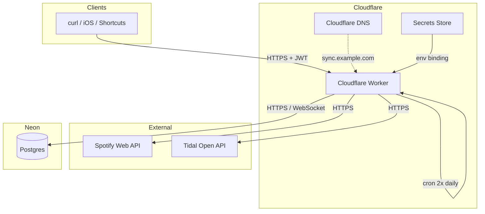
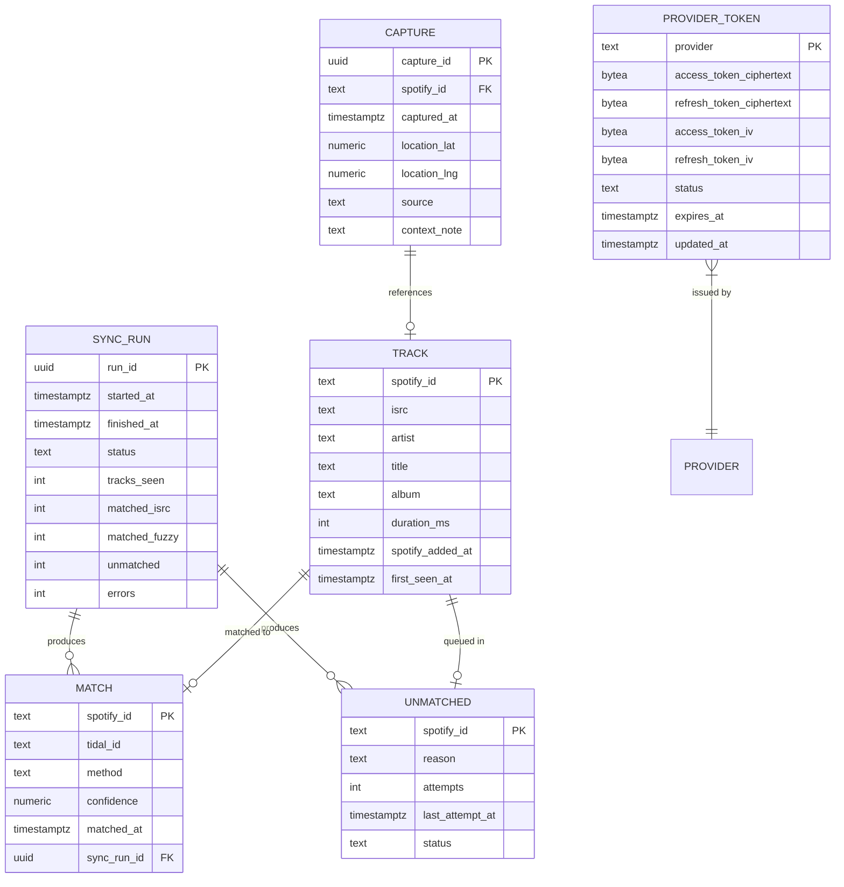
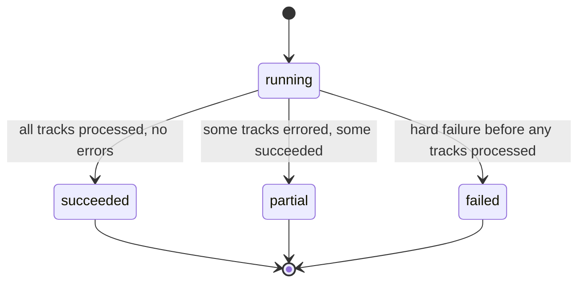
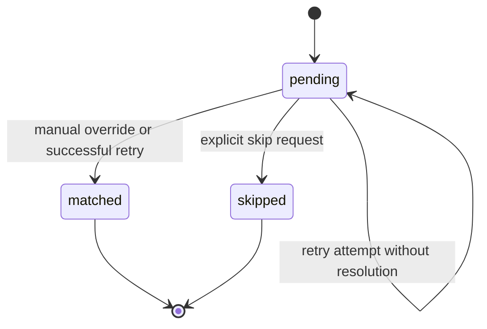

# Architecture

## 1. Context and boundaries

### 1.1 Purpose

The system synchronises tracks the user marks as Liked on Spotify into a designated Tidal playlist, on a recurring schedule. Roon consumes the Tidal playlist natively, completing the discovery-to-home-playback loop without any Roon-side integration.

### 1.2 In scope

- Periodic, unattended sync of Spotify Liked Songs to a Tidal playlist
- Authenticated HTTP API for status, manual trigger, manual override of unmatched tracks
- OAuth flows for Spotify and Tidal, with refresh-token rotation
- Audit trail of every sync run, every match decision, every unmatched track
- API surface designed to be reused by a future iOS companion app

### 1.3 Out of scope

- Roon plugin or Roon Extension
- Audio playback or any audio handling
- Multi-user support; the system serves a single account holder
- Reverse sync (Tidal → Spotify)
- Spotify or Tidal playlist beyond the single designated target playlist

### 1.4 Stakeholders

| Stakeholder | Concern |
|---|---|
| Account holder | Discoveries from Spotify reach Roon reliably and on schedule |
| Future iOS client | Stable, authenticated HTTP API |
| Cloudflare | Worker resource consumption within paid-tier limits |
| Neon | Database connection volume within free-tier limits |

### 1.5 External dependencies

| Dependency | Purpose | Failure impact |
|---|---|---|
| Spotify Web API | Read Liked Songs and track metadata | Sync runs fail; queued for retry |
| Tidal Open API | Search by ISRC, search by query, write playlist | Sync runs fail; queued for retry |
| Cloudflare Workers | Runtime, scheduled triggers, secrets | Total outage |
| Neon Postgres | Persistent state, encrypted tokens | Total outage |
| Cloudflare DNS | Custom domain resolution | API unreachable; sync still runs |

## 2. High-level architecture

### 2.1 Component responsibilities

| Component | Responsibility |
|---|---|
| Cloudflare Worker | All compute: HTTP API, scheduled handler, OAuth flows, sync engine, matching engine |
| Neon Postgres | Authoritative state: tokens (encrypted), tracks, matches, sync runs, captures |
| Cloudflare Secrets | OAuth client IDs/secrets, JWT signing key, token encryption key |
| Cloudflare DNS | Maps `sync.example.com` to the Worker route |

The Worker is stateless. All state lives in Neon. Restarts and redeployments MUST NOT cause data loss.

## 3. Domain model

### 3.1 Entities

> **Per F-004-R3**, each encrypted token gets a fresh independent IV; columns are separate (`access_token_iv`, `refresh_token_iv`) so GCM nonce reuse is structurally impossible. `provider_tokens.status` (`active` | `revoked`) tracks token lifecycle.

### 3.2 Invariants

- **I-001**: A `tracks.spotify_id` MUST appear in exactly one of `matches` or `unmatched` at any time, never both, never neither (after at least one sync attempt).
- **I-002**: A `matches.tidal_id` MUST resolve to a real Tidal track at the time of write.
- **I-003**: `provider_token` rows MUST always contain non-null ciphertext fields; plaintext tokens MUST NOT exist anywhere except in volatile Worker memory during use.
- **I-004**: `sync_runs.status` MUST be one of `running`, `succeeded`, `failed`, `partial`. Terminal states MUST have non-null `finished_at`.
- **I-005**: The cursor used to fetch new Spotify tracks MUST be advanced only after all tracks in a page are persisted.

## 4. Functional requirements

Functional requirements are detailed per feature in `docs/features/`. Each feature has a unique identifier `F-NNN`. The complete index is in the [README](../README.md).

## 5. Non-functional requirements

### 5.1 Performance

| Metric | Target |
|---|---|
| Sync run wall time, 50 new tracks | SHOULD be < 60 s |
| Sync run wall time, 500 new tracks | MUST be < 300 s |
| API median response time, authenticated read | SHOULD be < 200 ms |
| API p95 response time, authenticated read | MUST be < 500 ms |
| Cold-start to first response | SHOULD be < 100 ms (V8 isolate) |

### 5.2 Availability

The system is best-effort. A missed scheduled run is not an incident; the next scheduled run MUST process all unprocessed tracks since the last successful cursor advance.

| Metric | Target |
|---|---|
| Scheduled run success rate over 30 days | SHOULD be ≥ 95% |
| API uptime | SHOULD be ≥ 99% (governed by Cloudflare Workers SLA) |

### 5.3 Cost

| Metric | Target |
|---|---|
| Monthly recurring cost at 1,000 syncs/month | MUST be ≤ $5 |
| Database storage at 50,000 tracks | MUST be ≤ 0.5 GB |

### 5.4 Operability

- All errors MUST emit a structured log line with `run_id`, `feature`, `stage`, `error_code`, `message`.
- Every state transition on `sync_runs` MUST be logged.
- A new deployment MUST NOT require manual database migrations beyond running pre-defined SQL files.

## 6. API surface

All routes are JSON in, JSON out. All authenticated routes require `Authorization: Bearer <jwt>`.

| Method | Path | Auth | Purpose |
|---|---|---|---|
| GET | `/healthz` | none | Liveness probe |
| GET | `/auth/spotify` | bootstrap | Begin Spotify OAuth |
| GET | `/auth/spotify/callback` | none (state-validated) | Complete Spotify OAuth |
| GET | `/auth/tidal` | bootstrap | Begin Tidal OAuth |
| GET | `/auth/tidal/callback` | none (state-validated) | Complete Tidal OAuth |
| POST | `/sync/run` | JWT | Trigger immediate sync |
| GET | `/sync/status` | JWT | Latest run summary |
| GET | `/sync/runs?limit=20` | JWT | Recent runs |
| GET | `/unmatched` | JWT | Review queue |
| POST | `/unmatched/:spotify_id/match` | JWT | Manual match override |
| POST | `/unmatched/:spotify_id/skip` | JWT | Permanently skip |
| GET | `/captures` | JWT | List captures (iOS) |
| POST | `/captures` | JWT | Record a capture (iOS) |
| GET | `/stats?period=week` | JWT | Aggregate counts |

Detailed contracts in feature specs F-001 through F-014.

## 7. Data ownership and retention

| Data | Owner | Retention |
|---|---|---|
| `provider_tokens` | This system | Until OAuth revoked; rotated on every refresh |
| `tracks` | This system | Indefinite |
| `matches` | This system | Indefinite |
| `unmatched` | This system | Until resolved (matched manually) or skipped |
| `sync_runs` | This system | 365 days; older rows MAY be archived |
| `captures` | This system | Indefinite |

Spotify and Tidal own the catalog data referenced by ID; this system stores only IDs and a denormalised cache of artist/title/album for reporting.

## 8. State machines

### 8.1 sync_run

A run in `running` state with `started_at` more than 600 seconds ago MUST be considered abandoned and transitioned to `failed` on the next sync invocation.

### 8.2 unmatched

## 9. Security

### 9.1 Authentication

- All API routes except `/healthz` and OAuth callbacks MUST require a valid JWT.
- JWTs MUST be signed with HS256 using a 256-bit secret stored in Cloudflare Secrets.
- JWT verification MUST validate signature, expiry, issuer, and subject.
- The bootstrap JWT issued at first deploy is valid for 1 year. iOS Sign-in-with-Apple integration (future) will replace it.

### 9.2 Authorisation

Single-tenant: any valid JWT has full access. Tenant isolation is not in scope.

### 9.3 Token storage

- Spotify and Tidal access and refresh tokens MUST be encrypted with AES-256-GCM before persistence.
- The encryption key MUST come from Cloudflare Secrets and MUST NOT be derivable from any data in Neon.
- A unique 96-bit IV MUST be generated per encryption operation.
- Plaintext tokens MUST NOT appear in any log line.

### 9.4 Secrets inventory

| Secret | Purpose | Rotation |
|---|---|---|
| `JWT_SECRET` | Sign and verify API JWTs | Annually or on suspected leak |
| `TOKEN_ENCRYPTION_KEY` | Encrypt OAuth tokens at rest | Requires re-encryption migration |
| `SPOTIFY_CLIENT_ID` | OAuth client identifier | Per Spotify developer dashboard |
| `SPOTIFY_CLIENT_SECRET` | OAuth client credential | On suspected leak |
| `TIDAL_CLIENT_ID` | OAuth client identifier | Per Tidal developer dashboard |
| `TIDAL_CLIENT_SECRET` | OAuth client credential | On suspected leak |
| `DATABASE_URL` | Neon connection string | On password rotation |

### 9.5 Audit logging

Every authenticated API call MUST log: `timestamp`, `route`, `subject`, `status_code`, `duration_ms`. Logs go to Cloudflare's built-in observability; no external logging dependency.

## 10. Operations

### 10.1 SLOs

| SLO | Target |
|---|---|
| Scheduled run success rate (30-day) | ≥ 95% |
| Sync lag (Spotify like → Tidal playlist) | ≤ 13 hours p95 |
| Match rate (matched / total processed) | ≥ 90% measured monthly |

### 10.2 Runbooks

Per-feature failure modes and recovery steps live in the feature specs. The architecture document captures only cross-cutting incidents.

#### 10.2.1 Cron stopped firing

Cause: Cloudflare incident, deployment misconfiguration, account suspension.
Detection: `/sync/status` shows `last_run_at` older than 14 hours.
Recovery: Inspect Cloudflare dashboard; redeploy; trigger `POST /sync/run` to backfill.

#### 10.2.2 Database unreachable

Cause: Neon outage, expired connection string.
Detection: All sync runs fail with `db_unreachable`; `/healthz` returns 503.
Recovery: Verify Neon dashboard; rotate connection string if needed; redeploy.

#### 10.2.3 OAuth token refresh failure

Cause: User revoked access, provider rotated client secret, refresh token expired.
Detection: Sync runs fail with `oauth_refresh_failed` for the affected provider.
Recovery: Re-run the OAuth flow via `GET /auth/<provider>`.

### 10.3 Observability

- Per-run summary log line emitted at every run completion.
- Daily aggregate available via `GET /stats?period=day`.
- No metric collection beyond what's queryable from Postgres; no Prometheus, no DataDog.

## 11. Testing strategy

| Layer | Approach |
|---|---|
| Unit | Per-module pure functions: matcher, normalisation, JWT verification, encryption helper |
| Contract | Mocked Spotify and Tidal APIs to verify request shape and response handling |
| Integration | Real Neon test branch; full sync flow with stubbed Spotify/Tidal |
| End-to-end | Manual or scripted run against a sandbox account |
| Invariant | Property-based tests on matching engine: idempotency, monotonic cursor advance |

Specific test IDs and pass criteria live in `docs/tests/`.

## 12. Architectural decisions

### ADR-001: Cloudflare Workers as runtime

**Decision**: Use Cloudflare Workers, not a VPS-hosted process.

**Rationale**: Built-in scheduled triggers eliminate cron daemon. Near-zero cold start. HTTPS, secrets, DNS, and routing all in one platform. Free tier covers expected volume; paid tier is $5/mo if needed.

**Consequences**: Cannot use Node-only libraries that depend on the filesystem or raw TCP. Specifically: standard `pg` driver does not work; Neon serverless driver is required.

### ADR-002: Neon over Supabase for this workload

**Decision**: Use Neon Postgres, not Supabase Postgres.

**Rationale**: Supabase free tier pauses projects after extended inactivity, requiring manual unpause. Neon scales to zero with sub-second wake. Neon's `@neondatabase/serverless` driver speaks Postgres over HTTP and WebSockets, working natively in Workers.

**Consequences**: No built-in auth or storage from Supabase; we implement JWT directly. This is acceptable because the auth model is intentionally minimal.

### ADR-003: Hono as web framework

**Decision**: Use Hono.

**Rationale**: Designed for Workers, ~12 KB, Express-like API, full TypeScript support, mature middleware ecosystem.

**Consequences**: One additional dependency. No comparable lighter-weight option offers the same routing and middleware ergonomics.

### ADR-004: ISRC-first matching with fuzzy fallback

**Decision**: Try ISRC match before any fuzzy logic.

**Rationale**: ISRC is an exact identifier issued by the recording industry. When both providers know the same ISRC, the match is unambiguous and free.

**Consequences**: Tracks with mismatched regional ISRCs fall back to fuzzy matching. We accept this complexity in exchange for high precision on the common case.

### ADR-005: Single-tenant by design

**Decision**: Build for one user; do not generalise.

**Rationale**: Multi-tenancy adds tenant isolation, billing, signup flows, password reset, RLS policies, and a 10x increase in surface area, none of which the actual product needs.

**Consequences**: If a second user is ever required, this is a meaningful refactor. The auth boundary is clean, but the data model has no tenant column.

### ADR-006: Tidal playlist as the sync target, not Tidal favourites

**Decision**: Sync into a named Tidal playlist, not into Tidal favourites.

**Rationale**: A dedicated playlist is reversible without affecting the user's existing Tidal usage; Roon shows the playlist as a distinct entity; misclassified additions can be removed without consequence.

**Consequences**: One extra API call to ensure the playlist exists; one config value to track its ID.

## 13. Traceability

Every functional requirement in `docs/features/` is identified by `F-NNN`. Every test case in `docs/tests/` is identified by `T-NNN-MM` where `NNN` matches the feature it covers. Implementation MUST reference the corresponding `F-NNN` in commit messages and PR descriptions.

## 14. Glossary

| Term | Definition |
|---|---|
| Liked Songs | Spotify's saved-tracks collection, accessed via `GET /v1/me/tracks` |
| ISRC | International Standard Recording Code, a 12-character identifier for a specific recording |
| Run | One execution of the sync engine, identified by `run_id` |
| Cursor | The `spotify_added_at` timestamp marking the boundary between processed and unprocessed tracks |
| Match | A pairing between a Spotify track and a Tidal track |
| Provider | Spotify or Tidal |
| Bootstrap JWT | The long-lived token minted at first deploy for the account holder |
